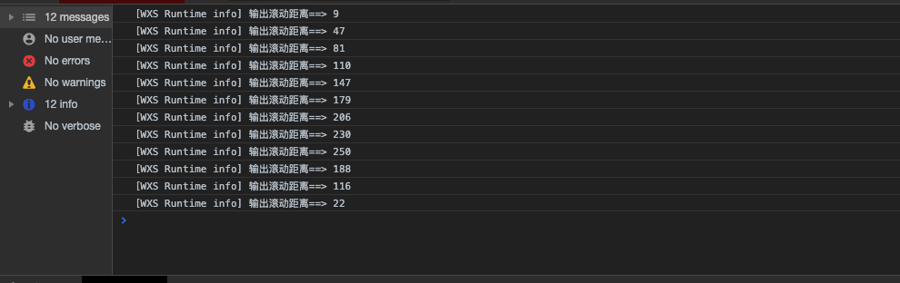
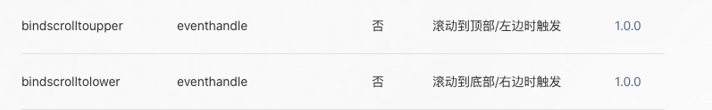
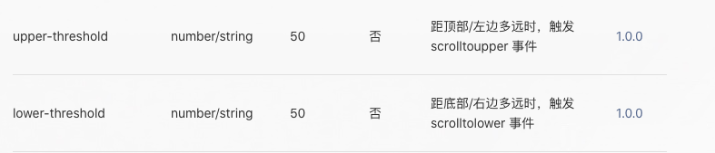

## 需求
上一次在处理小球动画的时候，我在官方文档里面发现了另一种的动画方式——[wxs](https://developers.weixin.qq.com/miniprogram/dev/framework/view/interactive-animation.html),
这种动画主要是用在有用户频繁交互的地方，如滚动等。

>思路是减少通信的次数，让事件在视图层（Webview）响应。小程序的框架分为视图层（Webview）和逻辑层（App Service），这样分层的目的是管控，开发者的代码只能运行在逻辑层（App Service），而这个思路就必须要让开发者的代码运行在视图层（Webview）

在文档里面，官方还有个[代码片段](https://developers.weixin.qq.com/s/L1G0Dkmc7G8a)，可以自行体验一下wxs的流畅度。
但是仔细体验的话就会发现官方示例中滚动菜单栏贴顶这个例子有个小问题
::: danger
快速滑动的话会出现背景透明度没有完全消失的问题
:::

## 原因
首先来看一下官方的wxs代码：
```js
var funcA = function (e, ins) {
  var scrollTop = e.detail.scrollTop
  
  if (scrollTop > 100) {
    ins.selectComponent('.page-group').setStyle({
      "background-color": 'black'
    }).addClass('page-group-position')
    ins.selectComponent('.page-banner .image').setStyle({
      opacity: 0
    })
  } else {
    ins.selectComponent('.page-group').setStyle({
      "background-color": 'rgba(00, 00, 00, ' + Math.max(0, (scrollTop) / 100) + ')'
    }).removeClass('page-group-position')
    ins.selectComponent('.page-banner .image').setStyle({
      opacity: 1 - Math.max(0, (scrollTop) / 100)
    })
  }
}
module.exports = {
  funcA: funcA
}
```
从上面的代码可以了解到，实现透明渐变的原理就是监听scroll-view的滚动距离，根据距离来按比例的变化导航栏的透明度和颜色。那么透明度没有完全消失的原因，首先就可以想到没有监听到滚动到0的事件。不了解scroll-view特性的，这是[传送门](https://developers.weixin.qq.com/miniprogram/dev/component/scroll-view.html)

我们可以自己在上面的函数中打印出监听到的滚动距离，测试结果:



证实了猜想，问题就出现在了没有监听到滚动到0的事件。而出现这种情况的原因，我想是因为精细度的问题，小程序的性能比不上web，精细度固然要差一些。
当然，这种情况很难发生在ios端，因为人家有弹性回弹嘛！

## 解决办法
问题既然出现了，就要去解决，那么解决的办法有哪些?
1. 既然监听到22就结束了，那我们就让他在22的时候将透明度变为0

这种想法看似简单，其实感觉也不失为一种解决办法。我们设置一个值，比如50，滚动的距离小于这个值就将透明度变为0。仔细一想，:tada::tada::tada:


但这种方法始终是敷衍了一点，毕竟测试中也会出现最后的滚动距离大于50的情况，而且如果用户的缓慢的滚动，就会出现还没滚动到0就结束了。

2. 换种思路，需要监听的事件是滚动的距离为0，那滚动距离为0是什么事件？滚动到顶部事件嘛！
scroll-view组件提供了回调事件


在wxs中新增一个监听滚动到顶部的函数，只要滚动到顶部，就将透明度变为0。:tada::tada::tada:

事情总不想想象那么简单，难怪说实践是检验真理的唯一标椎。
::: danger
在缓慢滚动的时候，渐变导航栏会一闪一闪
:::

这一闪一闪的原因，很简单，还没滚动到顶部就触发了滚动到顶部事件，而且触发了多次。遇见问题，首先找一下文档


这看得怎么这么眼熟？好家伙，这不就是思路1嘛！而且还会触发多次，这效果还不如思路1呢！

3. 既然回调事件不能完美监听到滚动到0，那我们手动实现
这里，我们需要用到另一种工具——[IntersectionObserver](https://developers.weixin.qq.com/miniprogram/dev/api/wxml/wx.createIntersectionObserver.html)

首先，我们在页面上固定两条线，一条固定在顶部（a线），另一条刚好隐藏在一个屏幕外，即top: windowHeight（b线）
```html
<view class="scroll-monitor-line" wx:if="{{ platform !== 'ios' }}"></view>
<view class="scroll-monitor-line-leave" style="top: {{ monitorLeaveLine }}px" wx:if="{{ platform !== 'ios' }}"></view>
```
这里增加条件判断是因为ios端完全不需要考虑这种问题.

接下来，我们就监听这两条线显示在屏幕和离开屏幕，如果a线显示在屏幕，那么就是滚动到顶部事件，直接设置透明度为0(changeOpacity为true)，如果b线显示在屏幕，那么就不是滚动到顶部，不做处理(changeOpacity为false)
```js
if (this.data.platform === 'ios') {
	return;
}
this.createIntersectionObserver().relativeToViewport().observe('.scroll-monitor-line', res => {
	if (res.intersectionRatio > 0) {
		console.log('显示')
		this.setData({
			changeOpacity: true
		})
	}
})
this.createIntersectionObserver().relativeToViewport().observe('.scroll-monitor-line-leave', res => {
	if (res.intersectionRatio > 0) {
		console.log('离开')
		this.setData({
			changeOpacity: false
		})
	}
})
```
至此，解决。:tada::tada::tada:
