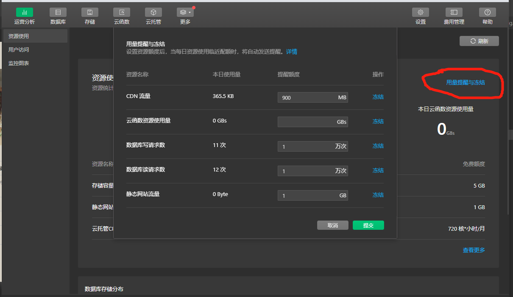
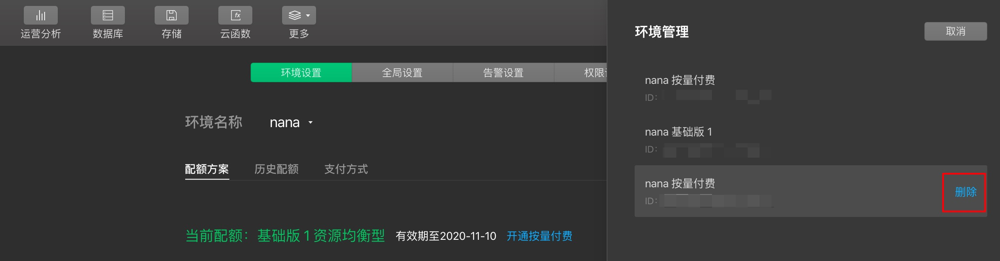

>小程序·云开发是微信团队联合腾讯云推出的专业的小程序开发服务。

>开发者可以使用云开发快速开发小程序、小游戏、公众号网页等，并且原生打通微信开放能力。

>开发者无需搭建服务器，可免鉴权直接使用平台提供的 API 进行业务开发。

## 前言
关于云开发，开发过小程序的都有耳闻

## 开通云开发
开通云开发有三种方式：
1. 在创建项目的时候直接选择云开发
2. 在开发者工具中点击左上角的「云开发」选择开通
3. 在微信公众平台中点击「云开发」，选择开通

## 注意事项
使用小程序云开发，有几点是需要知道的：
1. 小程序必须有AppId才能使用云开发，测试号无法使用;
2. 可以在微信开发者工具里点击「云开发」查看自己的云开发资源库
3. 最最重要的一点，云开发可以默认开通免费版，但是可以使用的资源很有限，如果自己的小程序只有几个人用，那么可以安心使用免费版。可以在云开发控制台上查看自己的资源剩余量，同时可以设置提醒

4. 除了管理我们的云开发资源，我们同样可以在云开发控制台上删除我们的云开发环境。打开云开发控制台 --->  点击右上角的设置按钮 ---> 点击环境名称（下拉展示） ---> 点击管理我的环境


## 云开发能力
> 小程序·云开发提供了多个基础能力，以下对各个主要能力介绍。

### 数据库
>云开发提供了一个 JSON 数据库，顾名思义，数据库中的每条记录都是一个 JSON 格式的对象。一个数据库可以有多个集合（相当于关系型数据中的表），集合可看做一个 JSON 数组，数组中的每个对象就是一条记录，记录的格式是 JSON 对象。

对于小程序数据库操作，有几个需要注意的点:
1. 首先是权限设置，数据库的权限设置分为两种，一种是基础设置，即官方已经将读写权限写好了，我们只需要选择就行了，简单，但是局限性比较大，如果我们需要更加精细的设置数据库的读写权限，就要用到我们的第二种规则，自定义安全规则。
#### 自定义安全规则
所谓自定义安全规则，就是自己设置数据库的读写权限，其路径为 「云开发控制台」 -> 「数据库」 -> 「权限设置」 -> 「自定义安全规则」

每个自定义的规则里面都有两个字段，分别是读（read）, 写（write），在一般的情况下，如果不是什么私密的数据，都是可以将read的值设置为true，表示所有人可读。
写入数据库的权限默认为创建者可写，如果还希望有人能够有写入数据库的权限，最简单的做法就是加一个 || 判断语句
```js
"write": "doc._openid == auth.openid || doc._openid == '用户的open_id'"
```
自定义安全规则的操作空间很大，点击[传送门](https://developers.weixin.qq.com/miniprogram/dev/wxcloud/guide/database/security-rules.html#%E7%AE%80%E4%BB%8B)查看官方提供的更多更全面的设置。
#### 增删改查操作
在操作数据库之前吗，我们需要获取数据库的引用
```js
const testDB = wx.cloud.database({
  env: 'test' // 可不设置，表示获取某个环境下的数据库引用
})
```
获取到数据库的引用之后，我们就可以获取数据库里面某个集合的引用，这样，才能对数据库里面的该集合进行增删改查的操作
```js
/**
 * 初始化数据库，并且获取数据库集合的引用
 * @param {Object} name 数据库集合名称
 * @returns {Object} 集合对象
 */
initDbBase(name) {
  return wx.cloud.database().collection(name) // 返回集合对象
},
```
1. 增加数据操作
```js
/**
 * 往数据库集合里面push信息
 * @param {Object} data
 */
postProductsList(data) {
  const db = this.initDbBase('集合名称')
  return db.add({
    data: {
      id: new Date().getTime(),
      ...data
    }
  })
}

try{ await this.postProductsList(info) } catch(e) { }
```
在这里，我是直接将当前的时间戳设置为数据的id值。
数据成功添加到云开发数据库，我们就可以打开云开发控制台查看我们添加的数据，可以发现数据多了两个字段: '' 和 '_openid'。根据官方的说词
>每条记录都有一个 _id 字段用以唯一标志一条记录、一个 _openid 字段用以标志记录的创建者，即小程序的用户。需要特别注意的是，在管理端（控制台和云函数）中创建的不会有 _openid 字段，因为这是属于管理员创建的记录。开发者可以自定义 _id，但不可自定义和修改 _openid 。_openid 是在文档创建时由系统根据小程序用户默认创建的，开发者可使用其来标识和定位文档。
2. 查询操作
```js
/**
 * 获取集合数据
 */
getProductList() {
  const db = this.initDbBase('集合名字')
  return db.get()
}
```
这里是直接获取集合的数据，不进行筛选。可以使用where对集合的数据进行筛选处理
> where 方法接收一个对象参数，该对象中每个字段和它的值构成一个需满足的匹配条件，各个字段间的关系是 "与" 的关系，即需同时满足这些匹配条件
```js
/**
 * 获取集合数据
 * @param {Object} data 筛选条件
 */
getProductList(data = { id: '1111', 'sku.name': '大' }) {
  const db = this.initDbBase('集合名字')
  return db.where(data).get()
}

ps: 表示嵌套字段
sku: {
  name: '大'
}
或者是 'sku.name': '大'
```
获取集合数据需要注意一点:
>为了防止误操作以及保护小程序体验，小程序端在获取集合数据时服务器一次默认并且最多返回 20 条记录，云函数端这个数字则是 100。开发者可以通过 limit 方法指定需要获取的记录数量，但小程序端不能超过 20 条，云函数端不能超过 100。

也就是说，我们一次性从集合里面获取的数据量是有限的，那么我们应该怎么去获取集合里面所有的数据呢？官方提供了一个使用云函数获取集合所有数据的例子
```js
const cloud = require('wx-server-sdk')
cloud.init()
const db = cloud.database()
const MAX_LIMIT = 100
exports.main = async (event, context) => {
  // 先取出集合记录总数
  const countResult = await db.collection('todos').count()
  const total = countResult.total
  // 计算需分几次取
  const batchTimes = Math.ceil(total / 100)
  // 承载所有读操作的 promise 的数组
  const tasks = []
  for (let i = 0; i < batchTimes; i++) {
    const promise = db.collection('todos').skip(i * MAX_LIMIT).limit(MAX_LIMIT).get()
    tasks.push(promise)
  }
  // 等待所有
  return (await Promise.all(tasks)).reduce((acc, cur) => {
    return {
      data: acc.data.concat(cur.data),
      errMsg: acc.errMsg,
    }
  })
}
```
代码的逻辑简单明了，需要获取的数据分次数去拿，然后使用promise.all将所有的数据整合在一起。根据这种思路，我们就可以仿写一个不使用云函数获取所有集合数据的例子
```js
const MAX_LIMIT = 20
async getProductList() {
  const db = this.initDbBase('集合名字')
  // 先取出集合记录总数
  const countResult = await db.count()
  const total = countResult.total
  // 计算需分几次取
  const batchTimes = Math.ceil(total / MAX_LIMIT)
  // 承载所有读操作的 promise 的数组
  const tasks = []
  for (let i = 0; i < batchTimes; i++) {
    const promise = db.skip(i * MAX_LIMIT).limit(MAX_LIMIT).get()
    tasks.push(promise)
  }
  // 等待所有
  return (await Promise.all(tasks)).reduce((acc, cur) => {
    return {
      data: acc.data.concat(cur.data),
      errMsg: acc.errMsg,
    }
  })
}
```
在这里有个小提示，因为async/await 是ES7 推出的新特性，所有微信工具平台编译的时候可能会出现下面这种错误
<!--  -->
当然，解决办法还是有的，在微信开发者工具中打开本地设置，选择增强编译即可。

3. 删除操作
```js
/**
 * 删除数据库集合的数据
 * @param {Object} data
 */
deleteProductsList(data) {
  const db = this.initDbBase('集合名称')
  return db.where(data).remove()
}

try{ await this.deleteProductsList({ name: '哈哈哈' }) } catch(e) { }
```
上面的代码表示删除集合里面名字为哈哈哈的数据

4. 修改操作
修改操作有两个步骤: 查询 -> 更新。
:::tip
查询：查找到数据库集合中对应的数据，这一步的操作就相当于是数据库集合的查询操作，详细的操作可以回顾，或者点击[传送门](https://developers.weixin.qq.com/miniprogram/dev/wxcloud/guide/database/query-array-object.html)

更新：即对查找到的数据进行相应的修改值的操作，使用update
:::
```js
updateProductsList(data, updateInfo) {
  const db = this.initDbBase('集合名称')
  return db.where(data).update(updateInfo)
}

try{ await this.updateProductsList({ name: '哈哈哈' }, { data: { 'name.$': '哈哈哈哈哈' } }) } catch(e) { }
```
> 更新数组字段的时候可以用 字段路径.$ 的表示法来更新数组字段的第一个满足查询匹配条件的元素。注意使用这种更新时，查询条件必须包含该数组字段。
:::注意事项
1. 不支持用在数组嵌套数组
2. 如果用 unset 更新操作符，不会从数组中去除该元素，而是置为 null
3. 如果数组元素不是对象、且查询条件用了 neq、not 或 nin，则不能使用 $
:::

### 存储
存储功能可以存储我们上传的文件，但是要注意一点，不同的云开发资源配置，存储的容量也不同，详细的配置可查看[云开发资源配置说明](https://developers.weixin.qq.com/miniprogram/dev/wxcloud/billing/quota.html)

