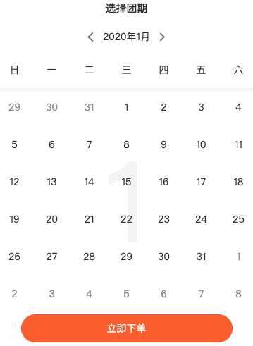
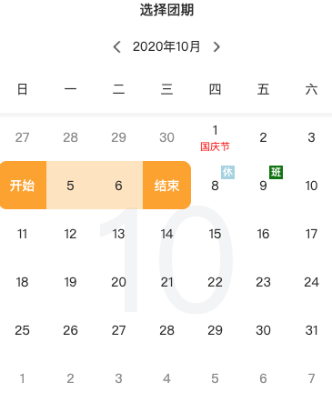
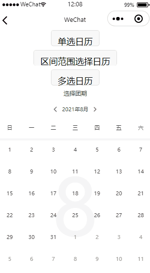

## 需求
做项目的时候需要用到一种日历，看完设计师的设计稿总结成：可以左右滑动切换显示的日历，能够在某一个日期下显示文字和标签，并且提供选择某一个范围内的日期和单选两种功能。

刚开始看到，想着这种组件网上也是一大堆。然而，查找了一番才知道大部分的日历组件都是上下滚动类型的，能够符合项目需求的组件不多。当然也有一些复杂的日历组件，但是我不想学习使用方法（懒）,又因为偶然间看到了[日历的简单实现思路](http://www.voidcn.com/article/p-wywquldl-es.html),自己花了点时间写这个组件
## 解析原件
根据项目需求，我得先清楚我的日历应该具备哪些信息：
```
1. 标题，旨在说明日历的用途，如选择购票时间，选择团期等
2. 副标题，用来显示当前的年月
3. 左右切换按钮，用来翻阅日历
4. 星期（日-六）
5. 一个月的天数的排列，通过循环，只要设置好每个格子的大小，就可以按照顺序排下去，但是我们得知道几点：
	5.1）每月的1号是星期几，即从哪个位置开始排
	5.2）每月有多少天，即要排多少个格子
6. 按照这种排列，肯定会出现前面几个格子是空白的，后面几个格子是空白的，即上下月的残余天数
	6.1）上个月的最后一天是几号，有多少
	6.2）下个月的残余天数有多少
7. 底部是否存在按钮，用来操作
```
分析出上面的几点，基本上可以确定为自己的日历应该是张什么样子



分析日历的显示：
```
1. 可以显示文字和标签，因为日历每个日期相当于一个块，所以利用定位可以很快解决显示的问题，颜色也可以根据传过来的属性进行自定义
2. 可以选择日期，从这可以分析出每一个块至少有三种颜色变化：没有选中状态，选中状态以及中间状态
```
从上面的分析可以知道，我们的数据结构应该长成这样子(展示部分)：
```js
/**
 * 日历副标题
 */
subTitle: {
	year: ''
	month: ''
}
/**
 * 日历信息
 */
calendarInfo: {
	last: {
		year: -1,
		month: -1,
		list: [],
		swiperHeight: 999
	},
	cur: {
		year: -1,
		month: -1,
		day: -1,
		select: -1, //选中的时间,位置
		swiperHeight: 999, //滚动框的高度
	},
	next: {
		year: -1,
		month: -1,
		list: [],
		swiperHeight: 999
	}
}, 
/**
 * 提示信息
 */
tipData: [
	{
		value: '2020-10-1',
		text: '国庆节',
		type: 'text',  //文本类型
		color: 'red'  //文本颜色
	},
	{
		vlaue: '2020-10-1',
		text: '休',
		type: 'tag',  //标签类型
		color: 'lightblue'，  //标签颜色
	}
]
```
那么此时的日历应该是长成这样


## 开始封装
1. 首先我选择的组件是微信小程序的[swiper](https://developers.weixin.qq.com/miniprogram/dev/component/swiper.html)
2. 确定每个月的1号是星期几
```js
	/**
	 * 获取某月1号是星期几
	 * @param {Object} date
	 * @returns {Number}
	 */
	getFirstDayWeek(date) {
		return new Date(date.year, date.month - 1, 1).getDay()
	},
```
3. 确定每个月的天数
```js
	/**
	 * 获取某年某月的总天数
	 * @param {Object} date
	 * @returns {Number} totalDays
	 */
	getTotalDays(date) {
		return new Date(date.year, date.month, 0).getDate()
	},
```
4. 根据第二点和第三点可以轻松知道当前月份的上个月的残余天数和下个月的残余天数（日历上显示的总天数是7的倍数,且最多显示6行）
```js
/**
 * 根据这个月，计算上下两个月的残余天数
 * @param {Object} date
 */
		calculateResidualDays(date) {
			// 计算上月残余天数,需要知道1号是星期几(个数)且上月最后一天是几号(起始数值)
			let last_value = dateUtil.getTotalDays({
				year: date.year,
				month: date.month - 1
			})
			for (let i = 0; i < date.firstDayWeek; i++) {
				date.list.unshift({
					value: this.properties.showRemnantDays ? last_value - i : '',
					type: 'last'
				})
			}

			// 计算下月残余天数,需要知道本月显示多少行
			let total = Math.floor(date.list.length / 7)
			if (date.list.length % 7 > 0) {
				++total
			}
			if (this.properties.fixRow) {
				// 设置了每月固定显示6行
				total = 6
			}
			let next_value = total * 7 - date.list.length

			// 设置滚动框的高度,设置变化的过渡动画
			date.swiperHeight = total * 107
			for (let i = 1; i <= next_value; i++) {
				date.list.push({
					value: this.properties.showRemnantDays ? i : '',
					type: 'next'
				})
			}

			//	格式化显示的提示信息
			this.formatShowTip(date)
		},
```
5. 大致上日历已经显示出来了，配置显示的文字和标签
```js
		/**
		 * 格式化文字标签
		 * @param {Object} date
		 */
		formatShowTip(date) {
			// 判断是否显示相关的节假日
			if (this.properties.showHoliday) {
				this.formatHolidayTip(date)
			}
			// 循环遍历找出对应的要显示的文字日期
			this.properties.dateText.forEach((item, index) => {
				date.list.forEach((arr, temp) => {
					let value = date.year + '-' + date.month + '-' + arr.value
					if (item.value === value && arr.type === 'cur') {
						arr.tip = item
					}
				})
			})
		},
```
6. 设置选中日期
7. 点击按钮

## 最后
因为代码的篇幅比较大，所以没有粘贴全部，只是一部分，详细的代码可见[小程序业务组件日历](https://github.com/ZhangXL-WaHaHa/wx-project-business-component)。
github里面的组件目前只是单纯的提供日历的显示，暂时还没有提供获取后端数据并且格式化的方法，这个可自行添加，也可以在切换月份的时候回调事件处理。

组件整体的效果变现为：



