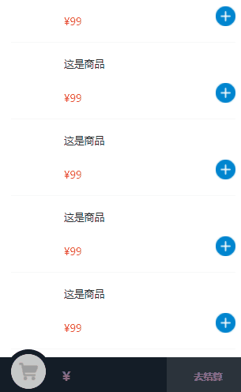

## 需求
在做点餐项目的时候，涉及到商品在加入购物车的时候显示小球以抛物线的形式掉落的动画
## 研究
在接触到这个需求之前，我也有研究过关于小程序的[动画](https://developers.weixin.qq.com/miniprogram/dev/framework/view/animation.html)，
但是基本上是对于线性变化，而小球动画的抛物线的形式。

从网上可以很容易查找到有关抛物线的动画，其原理就是[贝塞尔曲线](https://www.zhihu.com/question/29565629)

网上找到一篇大佬的文章，里面已经有了相关的抛物线小球的实现原理，[传送门](https://www.cnblogs.com/greengage/p/7815842.html),但是效果不合我意，所以我改写了部分。
## 实现
抛物线小球实现的基本原理：选点（关键帧），定时器将选中的点按照顺序显示出来。
### 选点
所谓选点，就是在手指点击的地方与购物车之间所形成的的抛物线中，选择其中几个坐标点，也就是关键帧。
首先我们确定三个点，起始点（手指点击的位置），终点（购物车位置）以及控制点,控制点的代码如下：
```js
if (this.finger['y'] < busPos['y']) {
	topPoint['y'] = this.finger['y'] - 150;
} else {
	topPoint['y'] = busPos['y'] - 150;
}
topPoint['x'] = Math.abs(this.finger['x'] - busPos['x']) / 2;

if (this.finger['x'] > busPos['x']) {
	topPoint['x'] = (this.finger['x'] - busPos['x']) / 2 + busPos['x'];
} else { //
	topPoint['x'] = (busPos['x'] - this.finger['x']) / 2 + this.finger['x'];
}
```
这里选点使用的是二阶贝塞尔曲线，我也没怎么弄明白贝塞尔曲线，但是有个代码可以直接拿来用，如下：
```js
/**
 * 获取小球运动的轨迹点
 * @param {Object} pots   三个控制点
 * @param {Number} amount 选中点的个数
 * @returns 
 */
bezier: function (pots, amount) {
	var pot;
	var lines;
	var ret = [];
	var points;
	for (var i = 0; i <= amount; i++) {
		points = pots.slice(0);
		lines = [];
		while (pot = points.shift()) {
			if (points.length) {
				lines.push(pointLine([pot, points[0]], i / amount));
			} else if (lines.length > 1) {
				points = lines;
				lines = [];
			} else {
				break;
			}
		}
		ret.push(lines[0]);
	}

	function pointLine(points, rate) {
		var pointA, pointB, pointDistance, xDistance, yDistance, tan, radian, tmpPointDistance;
		var ret = [];
		pointA = points[0]; //点击
		pointB = points[1]; //中间
		xDistance = pointB.x - pointA.x;
		yDistance = pointB.y - pointA.y;
		pointDistance = Math.pow(Math.pow(xDistance, 2) + Math.pow(yDistance, 2), 1 / 2);
		tan = yDistance / xDistance;
		radian = Math.atan(tan);
		tmpPointDistance = pointDistance * rate;
		ret = {
			x: pointA.x + tmpPointDistance * Math.cos(radian),
			y: pointA.y + tmpPointDistance * Math.sin(radian)
		};
		return ret;
	}
	return {
		'bezier_points': ret
	};
},
```
### 动画显示点
选完点之后，我们需要将这些点显示出来，与大佬不同，大佬选用的是利用定时器将选中的点显示出来，但是我要做的是小程序的动画，所以我就直接选中小程序的动画接口
1. 创建一个小球组件，组件的方法是执行动画,其中设置hide_good_box字段控制小球渲染
```js
this.setData({
	hide_good_box: false
})

this.animate(`#good_box-${this.properties.ballIndex}`, keyFrames, 150, function() {
	this.setData({
		hide_good_box: true
	})
	// 回调
	this.triggerEvent("endAnimation", this.properties.ballIndex)
	// 清除good_box动画
	this.clearAnimation(`#good_box-${this.properties.ballIndex}`)
}.bind(this))
```
2. 将选中的点格式化成每一帧的效果，然后调用小球组件的动画函数
```js
/**
 * 手指点击
 * @param {Object} e
 */
tapAdd(e) {
	// 简单判断手指点击位置是否是上次点击的位置，若是，直接是用上一次计算的关键帧数组
	if (Math.abs(this.data.bus_y - e.touches["0"].clientY) > 20) {
		this.data.keyFrames = []
		this.data.bus_y = e.touches["0"].clientY
		
		let points = ballFallAnimation.touchOnGoods({
			x: e.touches["0"].clientX - 10,
			y: e.touches["0"].clientY - 50
		}, this.busPos, 80)
		var index = 0,
			bezier_points = points['bezier_points'];

		var len = bezier_points.length;
		index = len

		// 放入关键帧
		for (let i = index - 1; i > -1; i--) {
			this.data.keyFrames.push({
				left: bezier_points[i]['x'] + 'px',
				top: bezier_points[i]['y'] + 'px',
				opacity: i === 0 ? 0 : 1,
				offset: 0.4
			})
		}
	}
	this.startAnimation()
},

/**
 * 开始动画
 */
startAnimation: function() {
	this.ballComponent.startAnimation(this.data.keyFrames)
},
```
在这一步，我做了一个小的优化，那就是将第一次手指点击的位置以及选点的位置存储起来，下一次点击的位置偏移距离不大的话，跳过选点的步骤，直接开始动画。
经过上面的步骤，已经可以得到一个完整的小球动画了，但是，问题，出现了:
::: danger
用户连续点击怎么办
:::
用户连续点击，理论上应该是出现连续小球，但是很遗憾，下面来自小程序官方介绍：

> 调用 animate API 后会在节点上新增一些样式属性覆盖掉原有的对应样式。如果需要清除这些样式，可在该节点上的动画全部执行完毕后使用 this.clearAnimation 清除这些属性。

那么，连续点击就会出现第一次点击小球还没掉到购物车那里，第二次点击，它又重新从手指点击的地方开始掉落动画，第三次，第四次……皆是如此。


3. 连续小球动画
关于这点，有一个很简单的做法，既然一个小球只能显示一个动画，那我设置多个小球，不就形成了连续动画吗？
```js
/**
 * 循环遍历所有小球的节点
 */
for (let i = 0; i < this.data.ballAnimationArray.length; i++) {
	// 获取小球节点信息
	this.ballAnimation = this.selectComponent(`#ball-${i}`)
	// 将小球信息存储
	this.ballComponent.push(this.ballAnimation)
}

/**
 * 开始动画
 */
startAnimation: function() {
  // 数组循环，每次开启动画弹出一个数组里面，完成动画之后重新排队
  let id = this.data.ballAnimationArray.pop()
  this.ballComponent[id].startAnimation(this.data.keyFrames)
},

/**
 * 动画结束
 * @param {Object} e
 */
endAnimation(e) {
  // 入队
  this.data.ballAnimationArray.unshift(e.detail)
  // 开启购物车动画
  this.startShopCartAnimation()
  // 处理事件逻辑
  // Tip: 后续事件逻辑最好少使用setData,不然在低端机上表现起来会很不流畅
},
```
这时动画效果为：


